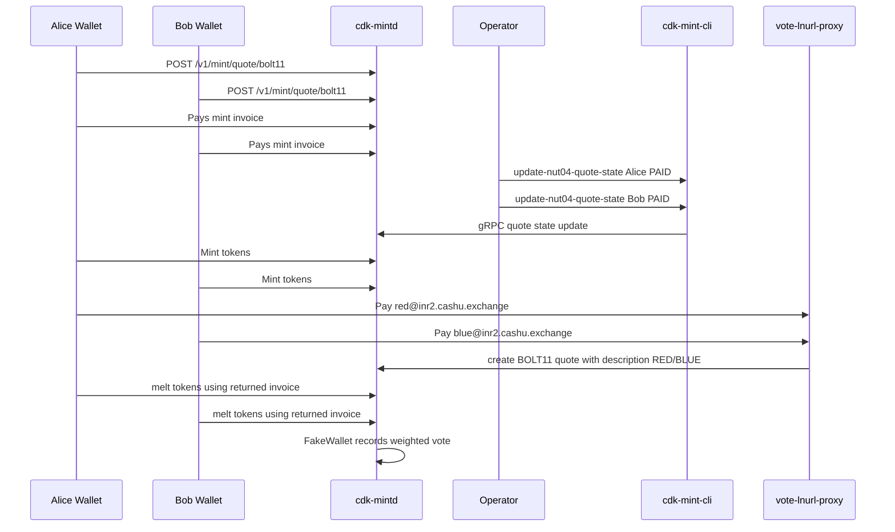

# FakeWallet Voting Deployment (`inr2.cashu.exchange`)

This guide deploys `cdk-mintd` as a FakeWallet-backed mint with RED/BLUE voting over:

- custom melts (`/v1/melt/quote/vote`, request `RED` / `BLUE`)
- BOLT11 descriptions encoding vote options
- LN-address aliases `red@inr2.cashu.exchange` and `blue@inr2.cashu.exchange`

Incoming mint quotes are manually approved (`manual_approval_incoming = true`) via management RPC.

## 1) Build `cdk-mintd` with required features

```bash
cargo build -p cdk-mintd --release --no-default-features --features "fakewallet,sqlite,management-rpc"
```

Binary path:

```text
target/release/cdk-mintd
```

## 2) Server prep (`root@inr2.cashu.exchange`)

```bash
apt update
apt install -y nginx certbot python3-certbot-nginx
id -u cdk-mintd >/dev/null 2>&1 || useradd --system --home /var/lib/cdk-mintd --create-home --shell /usr/sbin/nologin cdk-mintd
mkdir -p /etc/cdk-mintd /var/lib/cdk-mintd
chown -R cdk-mintd:cdk-mintd /var/lib/cdk-mintd
```

## 3) Install binary

```bash
scp target/release/cdk-mintd root@inr2.cashu.exchange:/usr/local/bin/cdk-mintd
ssh root@inr2.cashu.exchange 'chmod +x /usr/local/bin/cdk-mintd'
```

## 4) Configure `cdk-mintd`

Create `/etc/cdk-mintd/config.toml`:

```toml
[info]
url = "https://inr2.cashu.exchange/"
listen_host = "127.0.0.1"
listen_port = 8085
seed = "replace with a secure 32-byte hex seed"

[info.quote_ttl]
mint_ttl = 600
melt_ttl = 120

[info.http_cache]
backend = "memory"
ttl = 60
tti = 60

[mint_management_rpc]
enabled = true
address = "127.0.0.1"
port = 8086

[mint_info]
name = "INR2 Voting Mint"
description = "FakeWallet voting mint"
description_long = "Burn sats to vote RED or BLUE"

[database]
engine = "sqlite"

[ln]
ln_backend = "fakewallet"
min_mint = 1
max_mint = 500000
min_melt = 1
max_melt = 500000

[fake_wallet]
supported_units = ["sat"]
fee_percent = 0.0
reserve_fee_min = 0
min_delay_time = 0
max_delay_time = 1
manual_approval_incoming = true
voting_enabled = true
voting_options = ["RED", "BLUE"]
voting_topic = "Red vs Blue"
voting_fee_sat = 1

[limits]
max_inputs = 1000
max_outputs = 1000
```

Protect config:

```bash
chown root:cdk-mintd /etc/cdk-mintd/config.toml
chmod 640 /etc/cdk-mintd/config.toml
```

## 5) Systemd service

Create `/etc/systemd/system/cdk-mintd.service`:

```ini
[Unit]
Description=CDK Mint Daemon (FakeWallet Voting)
After=network.target

[Service]
Type=simple
User=cdk-mintd
Group=cdk-mintd
WorkingDirectory=/var/lib/cdk-mintd
ExecStart=/usr/local/bin/cdk-mintd --config /etc/cdk-mintd/config.toml --work-dir /var/lib/cdk-mintd
Restart=on-failure
RestartSec=5
LimitNOFILE=65536

[Install]
WantedBy=multi-user.target
```

```bash
systemctl daemon-reload
systemctl enable --now cdk-mintd
systemctl status cdk-mintd --no-pager
```

## 6) Deploy LN-address vote proxy (`red@` / `blue@`)

Install script from repo:

```bash
install -m 0755 crates/cdk-mintd/scripts/vote_lnurl_proxy.py /usr/local/bin/vote-lnurl-proxy
```

Create `/etc/default/vote-lnurl-proxy`:

```bash
cat >/etc/default/vote-lnurl-proxy <<'EOF'
VOTE_LNURL_HOST=127.0.0.1
VOTE_LNURL_PORT=8090
VOTE_LNURL_DOMAIN=inr2.cashu.exchange
VOTE_LNURL_MINT_URL=http://127.0.0.1:8085
VOTE_LNURL_MIN_SENDABLE_MSAT=1000
VOTE_LNURL_MAX_SENDABLE_MSAT=100000000
EOF
```

Create `/etc/systemd/system/vote-lnurl-proxy.service`:

```ini
[Unit]
Description=Vote LNURL Proxy (RED/BLUE)
After=network.target cdk-mintd.service

[Service]
Type=simple
EnvironmentFile=/etc/default/vote-lnurl-proxy
ExecStart=/usr/local/bin/vote-lnurl-proxy
Restart=on-failure
RestartSec=2

[Install]
WantedBy=multi-user.target
```

```bash
systemctl daemon-reload
systemctl enable --now vote-lnurl-proxy
systemctl status vote-lnurl-proxy --no-pager
```

## 7) Nginx reverse proxy

Create `/etc/nginx/sites-available/inr2.cashu.exchange`:

```nginx
server {
    listen 80;
    server_name inr2.cashu.exchange;

    location ^~ /.well-known/lnurlp/ {
        proxy_pass http://127.0.0.1:8090;
        proxy_set_header Host $host;
        proxy_set_header X-Real-IP $remote_addr;
        proxy_set_header X-Forwarded-For $proxy_add_x_forwarded_for;
        proxy_set_header X-Forwarded-Proto $scheme;
    }

    location ^~ /lnurl/cb/ {
        proxy_pass http://127.0.0.1:8090;
        proxy_set_header Host $host;
        proxy_set_header X-Real-IP $remote_addr;
        proxy_set_header X-Forwarded-For $proxy_add_x_forwarded_for;
        proxy_set_header X-Forwarded-Proto $scheme;
    }

    location / {
        proxy_pass http://127.0.0.1:8085;
        proxy_set_header Host $host;
        proxy_set_header X-Real-IP $remote_addr;
        proxy_set_header X-Forwarded-For $proxy_add_x_forwarded_for;
        proxy_set_header X-Forwarded-Proto $scheme;
    }
}
```

```bash
ln -sf /etc/nginx/sites-available/inr2.cashu.exchange /etc/nginx/sites-enabled/inr2.cashu.exchange
nginx -t
systemctl reload nginx
```

## 8) Issue Let's Encrypt cert

```bash
certbot --nginx -d inr2.cashu.exchange --non-interactive --agree-tos -m admin@inr2.cashu.exchange --redirect
certbot renew --dry-run
```

## 9) Verify deployment

```bash
curl -sS https://inr2.cashu.exchange/v1/info | jq .
curl -sS https://inr2.cashu.exchange/.well-known/lnurlp/red | jq .
curl -sS https://inr2.cashu.exchange/.well-known/lnurlp/blue | jq .
```

## 10) Manual authorization command (operator)

Approve a mint quote:

```bash
cdk-mint-cli --addr http://127.0.0.1:8086 update-nut04-quote-state <QUOTE_ID> PAID
```

## 11) End-to-end live demo (2 voters)

Helper script:

```bash
bash crates/cdk-mintd/scripts/voting_e2e_live_demo.sh
```

Auto-approve via SSH mode:

```bash
RPC_SSH_HOST=root@inr2.cashu.exchange \
bash crates/cdk-mintd/scripts/voting_e2e_live_demo.sh --auto-approve
```

### Sequence diagram



## 12) Notes

- Vote tallies are in-memory in `cdk-fake-wallet` and reset on restart.
- Vote options are case-insensitive.
- `manual_approval_incoming = true` disables automint; quotes stay `UNPAID` until operator approval.
- Custom vote strings (`RED`, `BLUE`) and LN-address encoded descriptions are both supported.
